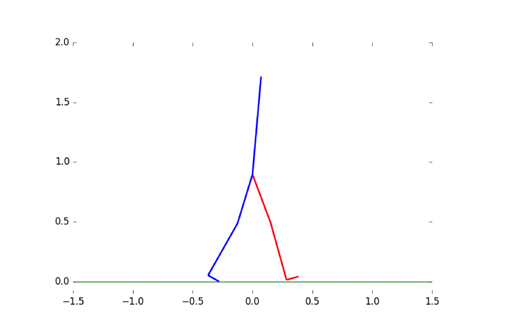
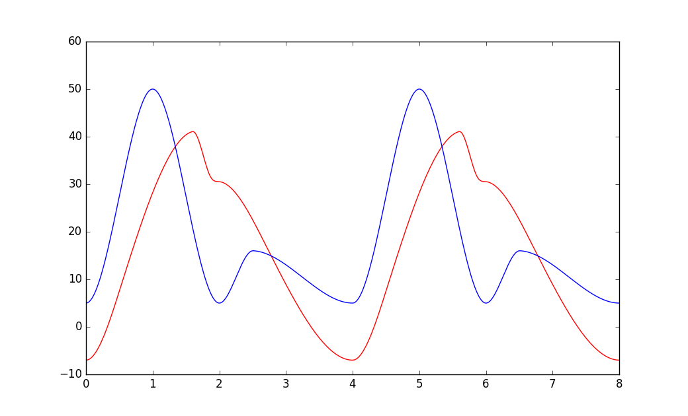
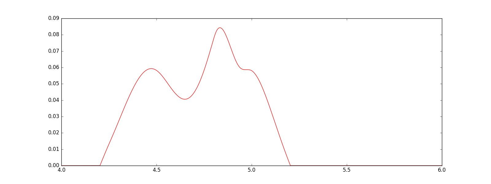
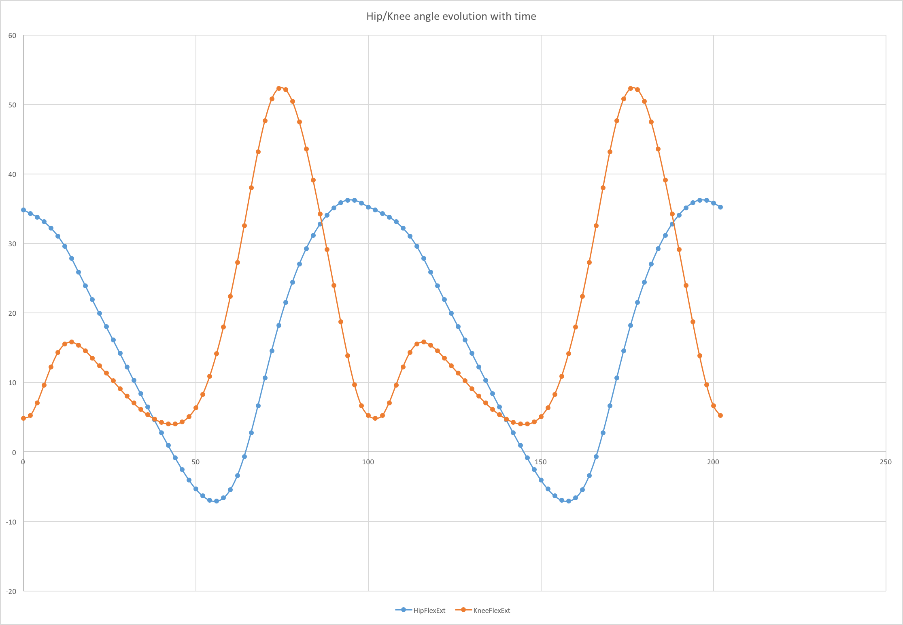
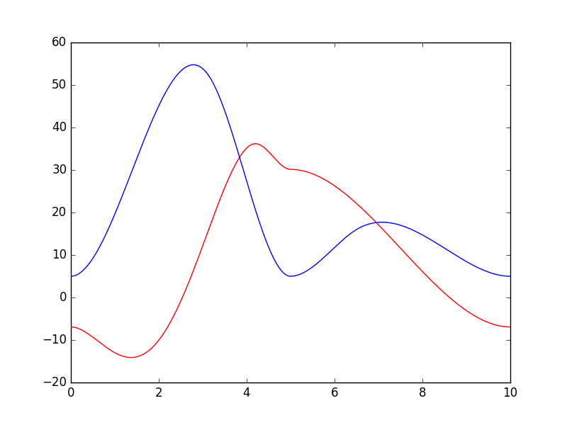

## Exoskeleton Control
#### By [Rui Wang](http://www.aray.pub), Dept. MechE, Tsinghua University 11/21/2017 @ UC Berkeley


### Introduction
This repository contains all codes for exoskeleton control for children with *cerebral palsy* (CP). We have an exoskeleton designed with two actuators, for the hip and the knee joint, respectively. The task is to control both two joints and let them follow desirable trajectories and/or generate desirable torque.

### See it Running!
We use C++ to carry out the calculation(for **speed**) while python to do the plotting(for **convenience**). An interface between two languages is established using [swig](http://www.swig.org).

The package comes with source codes already built. You can see it running without doing extra building. However if you do modify the code, you may have to rebuild the project. This requires that **g++, [swig](http://www.swig.org), python, matplotlib, and numpy** be installed properly on your computer. Also, this works for a UNIX-based system(LINUX, Mac OS). For windows there will be problems as I used some UNIX-specific commands for python programs and shell scripts.

To see it running directly, go to ```/littleGuyPlotter``` and type in commandline(note that your computer should be using python 2.7)

	python ExoPlotter.py
	
This should show you a little guy starting to walk. At first due to initilization the man is not walking right, but wait for a walking cycle and as it reaches steady state, it will walk continuously. Note that you can now press "p" on keyboard to stop the little guy and press "p" again to resume. The guy will not pause immediately though, rather, it will wait till the end of this step.

To build the project, first go to ```/py``` then use command ```make```. This will generate a folder ```/build``` where warped C++ files for python will be created.

In folder ```/py``` run

```
python trajectory_template_test.py
```
to see a plot of two trajectories, of the hip angle and knee angle, respectively. The sample plot is provided below. The x-axis is time while y-axis is the angle of two joints.


For better illustration, apart from the trajectory, we also included a file that plots a little guy who walks according to the trajectory we generated for his both two joints.

Go to ```/littleGuyPlotter```, run

```
python ExoPlotter.py
```
This will generate a dynamic graph where a little guy is walking according to the parameters we assigned him.

Within the same folder, you can also run

```
python toeClearancePlotter.py
```
to plot the toe clearance, i.e. the height of the toe from the ground. This value gives an idea how hight the exo is lifting its feet when walking, hence the power consumption. Also this makes sure the person do not get tripped over.


#### __Issue:__
**On some people's computers (or because of some different versions of matplotlib) the little guy does not appear when the command is executed. If this is the case, simply add a sentence ```time.sleep(0.001)``` in ```ExoPlotter.py```, line 127, directly after plotting, to allow the animation time to be updated.**

If you have changed the C++ file, you will need to rebuild the project. Under ```/littleGuyPlotter```, use command

	source build.sh
to build the project and automatically run the ```ExoPlotter.py```.

### Architecture & Explanation
The major architecture for the folder and their functions explained (irrelevent files are omitted):

```
.
├── README.md                           # readme
├── spline.h                            # spline interpolation
├── hip.h, knee.h, hip.cpp, knee.cpp    # knee & hip trajctory
├── littleGuyPlotter
│   ├── ExoPlotter.py                   # plot the little walking man
│   ├── PoseEstimator.py                # calculate coordinates used by ExoPlotter.py
│   ├── toeClearancePlotter.py          # plot height of the toe with respect to time
│   └── build.sh                        # run this if you changed c++ and need to rebuild
├── py
│   ├── Makefile                        # Makefile
│   ├── build                           # swig-warped c++ files for python
│   │   └──...
│   ├── hip/knee.i, setup_knee/hip.py   # swig file
│   ├── parameters.py                   # define key parameters
│   ├── trajectory_generator.py         # generate trajectory for curve-plotting
│   └── trajectory_template_test.py     # plot trajectory curve
├── STM32Project								# the project that can actually run with STM32
│   ├── hip.cpp
│   ├── hip.h
│   ├── knee.cpp
│   ├── knee.h
│   ├── main.cpp								# runs on STM32, prints hip angle every milisecond
│   ├── parameters.h						# cpp version for parameters.py
│   ├── spline.h
│   └── trajectory_generator.h			# generates trajectory for one hip
└── spline.h                            # generate spline
```

```/littleGuyPlotter/trajectory_generator.py``` is manily used for generating the trajectory. It can be paused and resumed through outside signal, like a press of a button.

To show this in software, I enabled a keyboard pausing mechanism through the same interface. Run ```ExoPlotter.py```, then you can press "p" on the keyboard to make the little guy stop. Note that the little guy will not stop immediately, rather, it will choose to stop at a suitable time, as described above.

In addition, to actually interface with the hardware, STM32 only recognizes cpp files. Therefore, we need to convert everything we previously used in python to c++. This needs some modification, and the files are stored under directory ```/STM32Project```.

#### Tip: how to tune parameters:
For most parameters, modify them in ```/py/parameters.py```. You will not need to rebuild. Note a tricky one is if you want to lower the hip angle at instant impact, you will need to decrease ```_step_range_``` or increase ```_leg_length_```, or both.

Other parameters are defined in C++ files and are relatively fixed. They are already tuned(for more than 3 hours I am tuning these parameters) and please, do not modify them unless you know what you are doing. Plus, you will need to rebuild the entire project, so you do not want to tune them.

### Trajectory Generation

#### Angle Data
We acquired the base data published on Clinical Gait Analysis, also known as [CGA](http://www.clinicalgaitanalysis.com/). The data we mainly referred to is also available [here](/data/Paulo_44_10yo.xlsx), it is based on 44 samples of kids averaging 10 years old. Plotting the data, we get a basic idea of how the curve should look like.


From there we set out to determine our curve input that we want the actuator to follow. Note that there are several key points we are interested in in order to generate the curve. In order for the curve to be generally desirable while adjustable, we manually selected these points and generate the curve accordingly. The curve has to pass through these points, while maintaining a similar shape as shown here.

#### Spline Interpolation
I used 3-rd order spline to generate the trajectory. In order to generate a desirable shape, I added redundant points on the graph to ensure a good performance. This method is very flexible and robust, though it might require a little tuning(but once tuned, you are good for any change in other parameters, plus I actually tuned it only once, so there is not really any major trade-off here).

For a previous version, I also implemented a _4-th order + 3-rd_ order version, with all _13_ coefficients pre-solved manually. However, over-fitting is inevitable under certain circumstances. Also, the solution is only feasible for normal walking, and cannot be adjusted to any other trajectory, which is not really portable. The takeaway here is that _3-rd_ order spline performs much better than higher orders in terms of overfitting issues, and therefore is the best way for spline generation. To see a simple example of overfitting, observe the plot attached below. Note how the red curve(hip angle trajectory) descends first before rising.


### Stopping
In order to stop, it is better to have all velocities at zero, otherwise the motor will stop abruptly. However, from all data we can conclude that this is not the case for real human walking. I also tried this method and plot it, the result was not desirable. So there is a trade-off here.

By observation, we can see that in normal human walking data, front hip angle, back hip angle, and front knee angle almost reach zero velocity at the same time. It is only the back knee that is moving fast. To be exact, at around 150 degrees per second. In this version, I favored the smooth stop with velocity 0, but the walking quality is thus sacrificed.

### Plotting
The plotting for the little guy is designed such that the little guy looks like to be walking on a treadmill. The result looks good. The idea is to

* make sure that the guy walks on a flat surface
* make sure that the guy do not do "flashmove"

The best way to do this is to set the origin with y direction at the lowest of all points(which is natural, since the guy is walking and he cannot penetrate the ground), and x direction right in the middle of the guy's hip(which is natural again, since the person's CoM would appear static relative to the ground).

Note that when drawing, foot length is reduced here, mainly because the fact that real ankle is not maintained to be perpendicular. In fact, ankle angle can deviate from 90 degrees quite much, especially when the foot is in its supporting phase. Therefore, keeping its original length will result in an extra-lift for the whole body(as origin is defined at the toe), making the other foot look like floating while in fact it is not. Applied in exoskeleton, the skeleton under patient's foot should be shorter than the foot itself. This way, the patient is able to bend his/her foot a bit during stance.

### Discussion
There is one major deficiency with this exo model: that the ankle angle is always 90 degrees. This differs from actual human model, therefore, double-stance only happens for an instant, as opposed to the actual human walking. 

In fact, there is no easy workaround - we cannot ensure a period of double-stance unless we generate the trajectory by **math equation** instead of **spline**. Nevertheless, we can rely on the fact that the actual exo foot is not as long as 0.12 body height, and the patient's foot actually exceeds that length. Human feet are soft and flexible, and the patient is able to have an actual double stance with his forefeet(or shoes, to be precise). Also, from the animation we can see that the foot is not lifted far from the floor after the instant "double-stance", therefore this approximation can be feasible.
